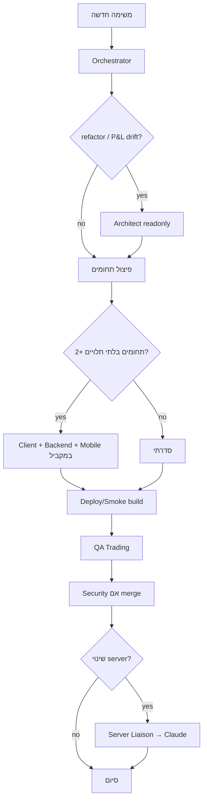

> 🚨 **IRON RULE (2026-06-24): GIT IS THE SOURCE OF TRUTH FOR CODE.** Ship via git only — edit → commit → `git push origin main` → `/root/deploy-tradesnow.sh`. NEVER scp/patch/hand-edit the server. Pull main before work, push after. See `.cursor/rules/git-source-of-truth.mdc` + `DEPLOY_WORKFLOW.md`.

---

# TradeSnow — Full Agent Roster (ELZA Teams)

**מדריך צוותים:** `docs/superpowers/ELZA-AGENT-TEAMS.md`  
**Dispatch files:** `.cursor/agents/*.md`

---

## ELZA Teams (שמות רשמיים)

### Builders

| כינוי | סקיל | תחום |
|--------|------|------|
| **Backhand** | `tradesnow-backend-dev` | `server/`, `drizzle/`, warEngine, IBKR |
| **Fronthand** | `tradesnow-frontend-dev` | `client/`, War Room, UI |
| **Fronthand-mobile** | `tradesnow-mobile-dev` | PWA, @375, touch |

### Audit & Strategy (readonly)

| כינוי | סקיל | תפקיד |
|--------|------|--------|
| **QA-Architect** | `tradesnow-qa-architect` + `qa-master-persona` | Red Team, **Ship Blocker** |
| **Quant-Strategy** | `tradesnow-quant-strategy` | ניקוד, sizing, תוחלת |
| **Architect** | `tradesnow-architect` | SSOT, ADR |
| **Base** | `tradesnow-base-archivist` | Git + Golden DNA |

### Coordinator

| כינוי | סקיל | תפקיד |
|--------|------|--------|
| **Orchestrator** | `tradesnow-orchestrator` | פיזור, merge, gates |

---

# TradeSnow — Full Agent Roster (legacy table)

מערכת סוכנים מלאה: כותבי קוד במקביל + תמיכה (QA, Design, Architect, Security, Deploy, Liaison).

**מדריך מהיר:** `docs/superpowers/AGENT-DISPATCH-GUIDE.md`

---

## SSOT

| מסמך | שימוש |
|------|--------|
| `docs/superpowers/2026-06-25-MASTER-OPEN-ITEMS.md` | משימות, בעלות C/X, gates |
| `docs/superpowers/specs/2026-06-24-manual-trading-ux-spec.md` | UX מסחר |
| `docs/superpowers/handoff/` | מסירה ל-Claude |

---

## 1. טבלת סוכנים מלאה

| סוכן | subagent / מצב | מודל מומלץ | סקילים | תחום | פלט חובה |
|------|----------------|------------|--------|------|----------|
| **Orchestrator** | צ'אט ראשי | Composer / Sonnet | `tradesnow-orchestrator`, `tradesnow-parallel-dispatch`, `using-superpowers` | פירוק משימה, dispatch מקביל, MASTER | תוכנית + מי עושה מה |
| **Client Dev** | `generalPurpose` | Codex / Composer | `tradesnow-frontend-dev` | `client/` בלבד | diff + `npm run build` |
| **Backhand** (= Client Dev server-side pair) | `generalPurpose` | Codex / Composer | `tradesnow-backend-dev` | `server/`, drizzle | build + API contract |
| **Mobile Dev** | `generalPurpose` | Composer | `tradesnow-mobile-dev` | @375, PWA, touch | screenshots + checklist |
| **QA Trading** | `explore` + `bugbot` | Sonnet thinking | `qa-master-persona`, `tradesnow-qa-trading` | לוגיקה, edge, mobile | `QA_AUDIT_REPORT.md` |
| **Design** | צ'אט / subagent | Sonnet | `tradesnow-design` → `ui-ux-master-persona` | hierarchy, friction, a11y | Friction + Patches |
| **Architect** | `explore` readonly | Opus thinking | `tradesnow-architect` | SSOT, boundaries, data flow | ADR + diagram |
| **Security** | `security-review` | built-in | `tradesnow-security` → `review-security` | auth, 2FA, secrets, orders | P0/P1 findings |
| **Deploy/Smoke** | `shell` + browser | Composer | `tradesnow-deploy-smoke`, `verification-before-completion` | build, routes, A6 | smoke report + evidence |
| **Server Liaison** | Claude חיצוני | — | `tradesnow-server-liaison` | server deploy, IBKR, pm2 | `README_FOR_CLAUDE` + MASTER |

> **Client Dev** = סקיל `tradesnow-frontend-dev` (אותו סוכן, שם תצוגה מהתוכנית המקורית).

---

## 2. מפת סקילים (קבצים)

### פרויקט — `.cursor/skills/`

| סקיל | סוכן |
|------|------|
| `tradesnow-orchestrator` | Orchestrator |
| `tradesnow-parallel-dispatch` | Orchestrator |
| `tradesnow-frontend-dev` | Client Dev |
| `tradesnow-backend-dev` | Backend Dev |
| `tradesnow-mobile-dev` | Mobile Dev |
| `tradesnow-qa-trading` | QA Trading |
| `tradesnow-design` | Design |
| `tradesnow-architect` | Architect |
| `tradesnow-security` | Security |
| `tradesnow-deploy-smoke` | Deploy/Smoke |
| `tradesnow-server-liaison` | Server Liaison |

### גלובלי — `~/.cursor/skills/`

| סקיל | סוכן |
|------|------|
| `qa-master-persona` | QA Trading |
| `ui-ux-master-persona` | Design |

### Superpowers (מובנה)

| סקיל | סוכן |
|------|------|
| `using-superpowers` | Orchestrator |
| `verification-before-completion` | Deploy/Smoke |
| `review-security` | Security |
| `review-bugbot` | QA Trading |

---

## 3. מתי להפעיל מה



---

## 4. Gates

| Gate | סוכן מאמת | תנאי |
|------|-----------|------|
| Build | Deploy/Smoke | `npm run build` ✅ |
| QA | QA Trading | 0 Critical |
| Security | Security | 0 P0 לפני merge |
| **A6** E2E | Deploy/Smoke + Claude | market open |
| **B10** merge | Orchestrator | אחרי A6 |

---

## 5. פקודות מהירות

```
תכנן ופזר במקביל: [משימה]          → Orchestrator
@frontend / @backend / @mobile       → כותבי קוד
ארכיטקט: למה P&L שונה?              → Architect
UX audit על Deep Analysis            → Design
QA תבדוק /trade                      → QA Trading
security review לפני merge           → Security
smoke אחרי deploy                    → Deploy/Smoke
handoff לקלוד על A7                  → Server Liaison
```

---

## 6. Parallel writers (מהירות)

מקסימום **3 כותבי קוד** במקביל + QA/Architect readonly במקביל:

| מקביל OK | סדרתי חובה |
|----------|------------|
| Client + Backend + Mobile | API לא מוגדר → Backend קודם |
| QA + Client (קבצים שונים) | אותו קובץ |
| Architect + Design (readonly) | Live order E2E |
| Security + QA לפני merge | — |

---

## 7. Deploy

| פעולה | מי |
|--------|-----|
| `npm run build` ב-repo | Deploy/Smoke (Cursor) |
| `pm2 restart` production | Server Liaison → Claude / משתמש |
| עדכון MASTER אחרי deploy | Server Liaison או Orchestrator |
