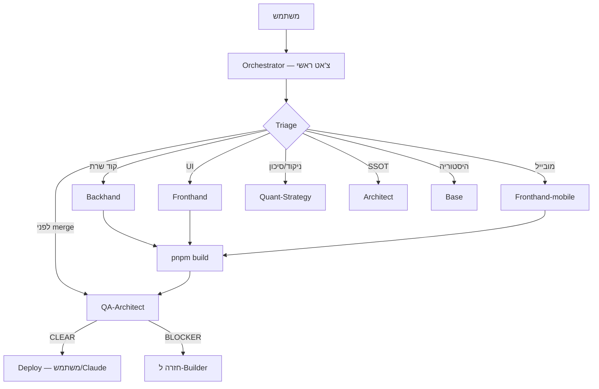

# TradeSnow — ELZA Agent Teams

מערכת הסוכנים לעבודה עם **Orchestrator** (הצ'אט הראשי).  
המשתמש מדבר איתי — אני מפזר למומחים.

---

## 1. Builders (כותבים קוד)

| כינוי | קובץ dispatch | סקיל | תחום |
|--------|---------------|------|------|
| **Backhand** | `.cursor/agents/backhand.md` | `tradesnow-backend-dev` | `server/`, `drizzle/` |
| **Fronthand** | `.cursor/agents/fronthand.md` | `tradesnow-frontend-dev` | `client/` |
| **Fronthand-mobile** | `.cursor/agents/fronthand-mobile.md` | `tradesnow-mobile-dev` | PWA, @375, touch |

**מקסימום 3 כותבים במקביל** (Backhand + Fronthand + Fronthand-mobile) — קבצים שונים בלבד.

---

## 2. Audit & Strategy (קריאה / ביקורת)

| כינוי | קובץ dispatch | סקיל | תפקיד |
|--------|---------------|------|--------|
| **QA-Architect** | `.cursor/agents/qa-architect.md` | `tradesnow-qa-architect` + `qa-master-persona` | Red Team, **Ship Blocker** |
| **Quant-Strategy** | `.cursor/agents/quant-strategy.md` | `tradesnow-quant-strategy` | ניקוד, sizing, תוחלת |
| **Architect** | `.cursor/agents/architect.md` | `tradesnow-architect` | SSOT, ADR, Split Brain |
| **Base** | `.cursor/agents/base.md` | `tradesnow-base-archivist` | Git + ארכיון Golden DNA |

כולם **readonly** אלא אם Orchestrator מאשר יישום (Quant → Backhand).

---

## 3. פקודות מהירות (עברית / אנגלית)

```
@backhand תקן את warEngine ...
@fronthand שדרג טבלת מועמדים ...
@fronthand-mobile War Room ב-375
@qa-architect תבדוק לפני deploy — ship blocker
@quant למה סף 8.0?
@architect למה P&L שונה בין מסכים?
@base חלץ לוגיקת Golden DNA ל-X
תכנן ופזר: [משימה גדולה]     → Orchestrator מפעיל Task במקביל
```

---

## 4. זרימת Orchestrator (ברירת מחדל)



---

## 5. SSOT מסמכים

| מסמך | שימוש |
|------|--------|
| `AGENTS.md` | רשימה מלאה + gates |
| `docs/superpowers/2026-06-25-MASTER-OPEN-ITEMS.md` | משימות פתוחות |
| `.cursor/rules/tradesnow-agents.mdc` | חוק תמיד-פעיל |

---

## 6. שמות ישנים → חדשים

| ישן | חדש |
|-----|-----|
| Backend Dev | **Backhand** |
| Client Dev / Frontend | **Fronthand** |
| Mobile Dev | **Fronthand-mobile** |
| QA Trading | **QA-Architect** |
| — | **Quant-Strategy** (חדש) |
| Architect | **Architect** (ללא שינוי) |
| — | **Base** (חדש) |

קבצי `backend.md` / `frontend.md` / `qa.md` נשארים כ-alias לתאימות לאחור.
