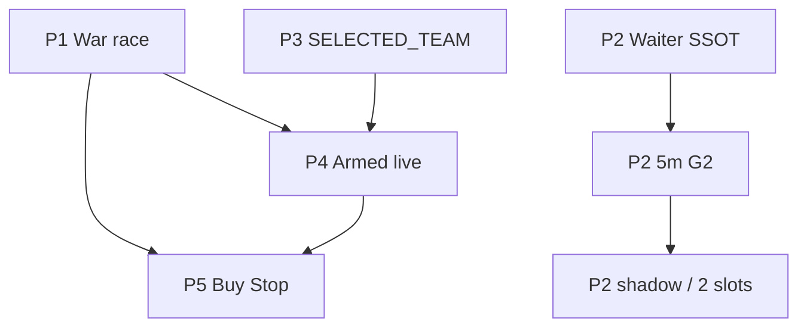

# Elza Priority Roadmap — אפיון פיתוח (P1–P5)

> **תאריך:** 30 ביוני 2026  
> **סטטוס:** ACCEPTED (owner-ratified)  
> **מקור-אמת:** Git (`main`) — פריסה רק דרך `/root/deploy-tradesnow.sh`  
> **קשור:** [`docs/QA_PLAN_WAITER_V45.md`](../../QA_PLAN_WAITER_V45.md), [`docs/DR_WAITER_RETEST_ELIGIBILITY.md`](../../DR_WAITER_RETEST_ELIGIBILITY.md)

---

## Executive Summary

חמישה מסלולי פיתוח בסדר ROI. **אין arm של מנגנונים שמשדרים פקודות באמצע RTH** ללא שערי GO מה-QA constitution.

| # | מסלול | ROI | מצב נוכחי | יעד |
|---|--------|-----|-----------|-----|
| **P1** | War race + מחזור בזמן | 🔴 הכי גבוה — כסף היום | חשד race / cooldown / לוגים חסרים | כל מחזור ENTER מבצע לוג per-ticker |
| **P2** | Waiter ZIV-SSOT + 5m G2 | 🔴 סוגר retest | SSOT נדחף; daily G2 = 0 fills (צפוי) | 5m backtest → shadow → 2 slots |
| **P3** | SELECTED_TEAM boost | 🟢 שעה | **חלקי** — `selectedTeam.ts` + UI ⭐ + Armed sort | חיווט מלא ב-War sort (אימות) |
| **P4** | Armed shadow → live | 🟡 פריצות זהב | בנוי; `elzaIntradayWatcherShadow` קיים | GO אחרי shadow dataset |
| **P5** | Buy Stop hybrid | ⚪ עתידי | לא קיים | רק אם P1–P3 מוכיחים צורך |

---

## עקרונות חוצי-מסלולים (לא לסטות)

1. **Git = SSOT לקוד** · **IBKR = SSOT למספרים**
2. **Rank boost ≠ gate bypass** — קדימות משנה **סדר**, לא **הרשאה**
3. **INERT by default** — כל flag חדש = `0` עד owner arm
4. **אין deploy mid-RTH** למסלולים שמשדרים פקודות
5. **Sector cap** — `MAX_PER_SECTOR = 3` (`warEngine.ts`) נשאר; SELECTED_TEAM לא עוקף

---

# P1 — War Race + מחזור שקונה בזמן

## הבעיה (מאומת / חשוד)

| תסמין | ראיה |
|--------|------|
| Funnel מדווח `ENTER=14–18`, `entered=0` | לוגים 30-Jun |
| מחזור מסתיים ב-**מילישניות** בלי `[LivePrice]` / `[RC2]` | אין לולאת ביצוע |
| `Already running — skipping` | `warEngine.ts:427-429` |
| Armed מפעיל `runWarEngineCycle(manual:true)` בזמן מחזור אוטומטי | `intradayArmedWatcher.ts:386-387` |
| Analyze + War **נורים במקביל** | `alertPoller.ts:1214` + `:1222` (לא `await`) |

## שורשים אפשריים

```
A. _warRunning latch — קריאה שנייה מחזירה busy (entered=0, scanned=0)
B. Cooldown — WAR_MIN_GAP_MS=20min / WAR_MANUAL_GAP_MS=30s (Vuln#1 log נוסף)
C. hourlyAnalyzeRunning — Armed Watcher מדלג 60s (alertPoller:1732)
D. מחזור ארוך (>2min scan) — חפיפה עם tick הבא
E. באג לוגי — entry loop לא רץ למרות candidates (לחקור)
```

## מטרת P1

> **כל מחזור War עם `ENTER>0` חייב להדפיס לוג ביצוע per-ticker, ו-`entered` חייב להתאים (או SKIP מפורש).**

## אפיון תיקון

### P1.1 — תזמור מסודר (alertPoller)

```text
היום:  runHourlyAnalyzeAll()  // fire-and-forget
       runWarEngineCycle()    // fire-and-forget — במקביל

יעד:   await runHourlyAnalyzeAll()
       await runWarEngineCycle()   // רצף, לא מקביל
```

אופציה B (מועדפת אם analyze איטי): War רץ **בסוף** `runHourlyAnalyzeAll` ב-`finally` — מחזור אחד אטומי.

### P1.2 — תור כניסות Armed (deferred trigger)

```text
Armed HELD_5M confirmed → enqueue WarTrigger { ticker, breakLevel, ts }
אם _warRunning → לא קורא runWarEngineCycle מיידית; מסמן pending
בסוף מחזור War → אם pending && cooldown ok → מחזור manual ממוקד
```

מונע `Already running` שבולע פריצה.

### P1.3 — נראות (חובה)

| לוג חדש | מתי |
|---------|-----|
| `[WarEngine] Cooldown skip` | כבר קיים — לוודא בפרוד |
| `[WarEngine] Entry loop start: N candidates` | תחילת לולאת ביצוע |
| `[WarEngine] {ticker} SKIP: {reason}` | כל candidate שלא נכנס |
| `[WarEngine] Busy — Armed trigger deferred` | תור Armed |

### P1.4 — מדדים (War Room / getStatus)

```typescript
warEngineStatus: {
  running: boolean;
  lastCycleAt: number;
  lastEntered: number;
  lastScanned: number;
  lastSkipReason: "busy" | "cooldown" | "ok";
  armedDeferred: boolean;
}
```

## קבצים

| קובץ | שינוי |
|------|--------|
| `server/alertPoller.ts` | רצף analyze→war; אופציונלי war בסוף analyze |
| `server/warEngine.ts` | לוגים ב-entry loop; deferred queue; export status |
| `server/intradayArmedWatcher.ts` | enqueue במקום fire-and-forget כש-busy |
| `server/warEngine.race.test.ts` | **חדש** — busy latch, cooldown, deferred |

## שערי GO (P1)

| ID | קריטריון |
|----|-----------|
| P1-G0 | `pnpm test server/warEngine.race.test.ts` ירוק |
| P1-G1 | יום RTH: אפס מחזורים עם `ENTER>0` ו-`entered=0` ב-<100ms |
| P1-G2 | לוג `Entry loop start` בכל מחזור מלא |
| P1-G3 | Armed breakout → כניסה או `deferred` → כניסה במחזור הבא (≤60s) |

## לא לעשות ב-P1

- לא לשנות שערי Ziv / RC2 / sizing
- לא להקטין `WAR_MIN_GAP_MS` מתחת ל-5 דקות בלי מדידה (spam risk)

---

# P2 — Waiter ZIV-SSOT + 5m Backtest / Shadow

## הקשר

- **DR:** [`DR_WAITER_RETEST_ELIGIBILITY.md`](../../DR_WAITER_RETEST_ELIGIBILITY.md) — superseded חלקית ע"י **WAITER-ZIV-SSOT** (gate אחד = `detectTrueRetest` / `retestLevel`, לא `evaluateRetestV2`)
- **לקח:** backtest **יומי** ל-Waiter ≈ 0 fills — **לא באג** אלא רזולוציה (מגע ±2% = intraday)

## Gate SSOT (live + backtest)

```yaml
eligible:
  - tier == "Gold Retest"
  - retestLevel != null          # ziv.retestLevel
  - weeklyBullish == true
  - live > ema50
  - distPct <= 2.0               # RT-03
  - live >= retestLevel × 0.98   # RT-04
  - gapGuard <= 1.5%             # EX-03 FOMO
  - distPct <= 5.0               # EX-07 (אופציונלי)

LMT:  retestLevel × 1.0075
stop: max(retestLevel × 0.99, wideLungSL)
size: vixRiskSize (1% NLV)
```

**אסור:** `evaluateRetestV2.valid`, `detectZones` בנתיב Waiter.

## G2 — פרוטוקול מדידה

### שלב א — funnel יומי (sanity)

`scripts/waiterBacktest.ts` — מונים מפורשים:

```
distPctBlocked | belowFloor | fomoBlocked | ambushNull | placed | filled
```

### שלב ב — G2 אמיתי (5m)

`scripts/waiterBacktest5m.ts` (קיים):

```bash
WAITER_BT5M_DAYS=30 \
WAITER_BT5M_TICKERS="AAPL,MSFT,..." \
node --import tsx --env-file=.env scripts/waiterBacktest5m.ts
```

- טיקרים = רק מה שיצא `Gold Retest` ב-pass היומי
- מקור 5m: `fetchIntradayBarsForTicker('5m')` (Yahoo)
- אם `5M_UNAVAILABLE` לכל הטיקרים → **Fallback שלב ג**

### שלב ג — Shadow חי

```text
waiterEnabled=0  (INERT)
waiterShadow=1   (חדש — לוג WAITER_WOULD_ARM / SKIP בלבד)
```

או לוגים ב-`runWaiterTick` ללא `placeRestingBracket` עד GO.

### שלב ד — Arm מדורג

```
waiterEnabled=1, maxRetestSlots=2, 30% sub-cap
→ יום מלא → maxRetestSlots=10
```

## קבצים

| קובץ | סטטוס |
|------|--------|
| `server/waiterEngine.ts` | WAITER-ZIV-SSOT |
| `scripts/waiterBacktest.ts` | ליישר funnel + gate |
| `scripts/waiterBacktest5m.ts` | G2 harness |
| `server/waiterEngine.test.ts` | 65+ tests |
| `drizzle/` | `waiterEnabled` ב-`liveEngineConfig` (אם חסר) |

## שערי GO (P2)

| ID | קריטריון |
|----|-----------|
| P2-G0 | `pnpm test server/waiterEngine.test.ts` ירוק |
| P2-G1 | 5m backtest 30d: **placed > 0** |
| P2-G2 | 5m backtest: **fills > 0** |
| P2-G3 | shadow יום אחד: לפחות 1 `WOULD_ARM` ב-RTH |
| P2-G4 | live 2 slots: 0 naked, 0 double-fill (R1), STP מאושר ≤25s |
| P2-G5 | AvgR ≥ 0 (רצוי, לא blocker ל-arm ראשון) |

## אנטי-קלובר

- **לא לגעת ב-Waiter** באותו PR עם SELECTED_TEAM
- SELECTED_TEAM ב-Waiter top-N **אחרי** P2-G4

---

# P3 — SELECTED_TEAM Boost (rank בלבד)

## מצב נוכחי (מאומת בקוד)

| רכיב | קובץ | סטטוס |
|------|------|--------|
| SSOT רשימה | `server/selectedTeam.ts` | ✅ 15 tickers, `SELECTED_TEAM_BOOST=0.4` |
| DB seed | `drizzle/0144_selected_team_seed.sql` | ✅ |
| War sort | `warEngine.ts:1300-1311` | ✅ `effectiveSortScore` |
| Armed top-N | `intradayArmedWatcher.ts` | ✅ sort tiebreak |
| UI ⭐ | `WarRoomCandidatesTable.tsx` | ✅ |
| API | `liveEngine.getStatus().selectedTeam` | ✅ |

## מה נשאר (אם בכלל)

| משימה | עדיפות |
|--------|--------|
| אימות E2E: AMD ב-team מדורג מעל non-team באותו score | P3 |
| תיעוד owner: עריכת רשימה ב-`systemSettings.selected_team` | P3 |
| **לא** לחבר ל-`mentorBonus` / `calcMentorBoost` — מנגנון נפרד בכוונה | — |

## כללים (חוזרים)

```typescript
effectiveSortScore(base, ticker, team) =
  team.has(ticker) ? min(10, base + 0.4) : base

// SORT / top-N ONLY — never gate, size, or route
```

## שערי GO (P3)

| ID | קריטריון |
|----|-----------|
| P3-G0 | `pnpm test server/selectedTeam.test.ts` ירוק |
| P3-G1 | War Room מציג ⭐ ל-15 tickers |
| P3-G2 | AMD (team) מופיע לפני peer זהה (non-team) בטבלה |

## Effort

~1–2 שעות (בעיקר אימות + תיעוד) — **רובו כבר מיושם**.

---

# P4 — Armed Watcher: Shadow → Live

## מה קיים

```
ARMED → CROSSED → HELD_5M (5m + RVOL≥1.2) → runWarEngineCycle(manual)
```

| קבוע | ערך |
|------|-----|
| `ARM_PROXIMITY` | 4% מתחת לקו |
| `WATCHER_TOP_N` | 10 |
| `ANTI_CHASE_MULT` | 1.035 |
| `elzaIntradayWatcherEnabled` | 0 (INERT) |
| `elzaIntradayWatcherShadow` | 0/1 |

## מסלול arm

```text
1. elzaIntradayWatcherShadow=1  → לוג [ArmedWatcher-SHADOW] would ENTER
2. אסוף 5–10 ימי dataset: ticker, breakLevel, RVOL, would-enter vs actual
3. elzaIntradayWatcherShadow=0, elzaIntradayWatcherEnabled=1
4. cadence: universe War :00 בלבד (alertPoller F4a) — Armed מטפל intra-hour
```

## שערי GO (P4)

| ID | קריטריון |
|----|-----------|
| P4-G0 | P1 deferred queue עובד (Armed לא נבלע) |
| P4-G1 | shadow ≥5 ימים: precision — would-enter שמגיע ל-HELD_5M הגיוני |
| P4-G2 | live: ≥1 breakout entry דרך Armed בלי double bracket |
| P4-G3 | anti-chase: 0 כניסות כש-live > breakLevel×1.035 |

## קשור לפריצות זהב

- `goldBreakoutEnabled=0` נשאר ל-War market הכללי
- Armed = מסלול **מבוקר** לפריצות (עם RVOL + 5m)
- **לא** לפתוח breakout chase לכל הקטלוג

---

# P5 — Buy Stop Hybrid (עתידי — תנאי)

## מתי להתחיל

רק אם **אחד**:

1. PM2 downtime גורם לפספוס פריצות ש-shadow תפס
2. P4 live ≥30 יום + lag War >60s על HELD_5M
3. owner מבקש במפורש אחרי P1–P4

## MVP (אם מאושר)

```yaml
scope:
  max_concurrent: 2
  tickers: top-3 GOLD_BREAKOUT_WAR מ-Armed list בלבד
  conditions:
    - live <= breakLevel × 1.04    # ARM zone
    - live <= breakLevel × 1.015   # FOMO
    - readinessPct >= 70
  order:
    type: STP LMT BUY
    trigger: breakLevel
    limit: breakLevel × 1.003
    tif: DAY
  bracket: wideLungSL STP child
  dedup: אם Armed הזמין → לא STP על אותו ticker
```

## לא לעשות

- לא על 15 SELECTED_TEAM (רובן מורחבים QTD)
- לא replacement ל-Armed
- לא לפני P2-G4

---

# לוח זמנים מומלץ

| יום | משימה | מסלול |
|-----|--------|--------|
| D0 | P1 תזמור + לוגים + tests | P1 |
| D1 | P1 deploy + מעקב RTH | P1 |
| D1 | P3 אימות (אם לא גמור) | P3 |
| D2 | P2 5m backtest על droplet | P2 |
| D3 | P2 shadow / fallback 2 slots | P2 |
| D4+ | P4 shadow | P4 |
| TBD | P5 רק לפי טריגר | P5 |

**אין פריסה מסחרית אחרי 16:30 IL פתיחה** — רק אחרי סגירה או INERT.

---

# מטריצת תלויות



---

# Definition of Done (כל המסלול)

- [ ] `pnpm check && pnpm build && pnpm test` ירוק
- [ ] עדכון [`docs/QA_PLAN_WAITER_V45.md`](../../QA_PLAN_WAITER_V45.md) אם שערים משתנים
- [ ] `git commit` → `git push origin main` → `deploy-tradesnow.sh`
- [ ] לוגים מאומתים ב-droplet אחרי deploy
- [ ] owner sign-off על arm (flags מ-0 ל-1)

---

*מסמך זה הוא SSOT לסדר העבודה P1–P5. שינוי סדר או arm דורש עדכון DR + owner.*
