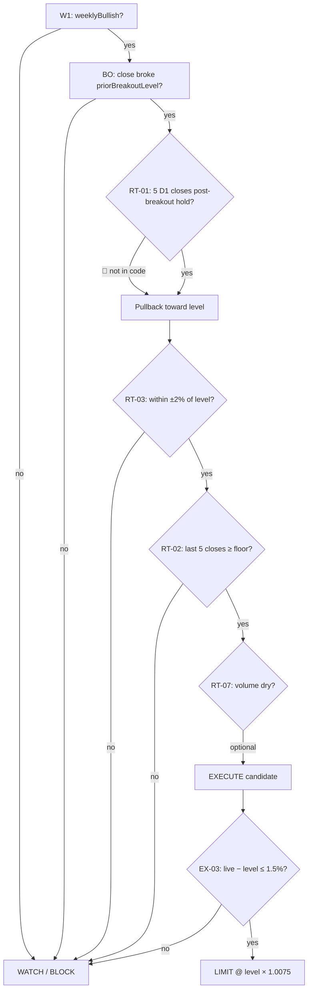

# GAP #2 — Retest Mechanics (שיעור 14)

**מסמך:** `docs/ziv-engine-spec/gaps/GAP_02_RETEST.md`  
**תאריך:** 26 יוני 2026  
**מקורות:** שיעור 14 (Focus Trader PDF — סיכום במחקר v2.3), `2026-06-24-ziv-methodology-research.md` §11.5, `2026-06-19-elza-ziv-alignment-guidelines.md` §סוג 2, `server/trueRetestEngine.ts`, `server/gapGuard.ts`, `server/breakoutScanner.ts`, `server/liveOrderExecutor.ts`  
**סטטוס PDF ישיר:** שיעור 14 ב-`cyclestrading-course.com/wp-content/uploads/2023/01/` → **404** (26.6.2026). כללים מסומנים 📄 לפי סיכום המחקר המאושר, לא ציטוט PDF גולמי.

**מקרא:**

| סימון | משמעות |
|--------|---------|
| ✅ | מאושר במחקר + ממופה לפרמטר מנוע (מיושם או מוגדר כאן) |
| 📄 | מקור קורס/מחקר — לא אומת מ-PDF גולמי או לא מיושם במלואו |
| ⚠️ | פער, עמימות, או סתירה בין מקורות/קוד |

---

## תשובות ישירות (4 שאלות המשימה)

### Q1 — "5 candles after breakout": אילו נרות, באיזה TF?

| שכבה | תשובה |
|------|--------|
| **זיו (שיעור 14)** 📄 | **5 נרות באותו timeframe** של הגרף שעליו סוחרים — **אחרי** פריצה, **לפני** שמותר לשקול כניסת ריטסט. מגמה ראשית = **שבועי**; ביצוע = **הוראת לימיט** (לא שוק). |
| **Elza (מנוע)** ✅ | **יומי (D1)** — כל חישובי `detectTrueRetest`, `zivEngine`, `breakoutScanner` רצים על **נרות יומיים** (OHLCV). שבועי = gate מגמה בלבד (`WK-L` / `weeklyBullish`). |
| **מהן "5 הנרות"?** ⚠️ | **פער מפרש:** המחקר מתרגם "אישור פריצה" = 5 נרות **אחרי** הפריצה (cooldown). הקוד ב-`trueRetestEngine` מפרש = 5 **סגירות אחרונות** שמחזיקות מעל הרמה **בזמן הריטסט** (hold). שני המשמעויות שונות — ראו RT-01 vs RT-02. |

**הגדרה מנועית מוצעת (מאחדת):**

```
TF_EXECUTION     = D1          // נר יומי
TF_TREND         = W1          // מגמה ראשית — gate בלבד
CANDLE_TYPE      = close       // סגירה (לא פתיחה/פתיל בלבד)
POST_BREAKOUT_N  = 5            // RT-01: נרות אחרי פריצה
RETEST_HOLD_N    = 5            // RT-02: נרות החזקה בריטסט (קוד נוכחי)
```

---

### Q2 — Retest confirmation: נר קפיצה? תבנית?

| סוג אישור | זיו / שיעור 14 | Elza היום | סטטוס |
|-----------|----------------|-----------|--------|
| **מגע ברמה** | חזרה לבדוק רמה שנפרצה (היפוך תפקיד) 📄 | `\|close − level\| / level ≤ 2%` ✅ `RETEST_TOLERANCE_PCT` | ✅ |
| **החזקה מעל הרמה** | לא ליפול חזרה מתחת לתמיכה החדשה 📄 | `close ≥ level × (1 − 2%)` לכל 5 הנרות האחרונים ✅ `trueRetestEngine` | ✅ (פרשנות hold) |
| **נר אישור (PA)** | "מתקשה לרדת, מתחילה לטפס" (איכותי) 📄 | Hammer / Inside Bar / Bullish Engulfing → בונוס ציון 7→8 ⚠️ לא gate חובה ב-`zivEngine` | ⚠️ |
| **נפח יבש במשיכה** | מחזורי מסחר יבשים בריטסט 📄 | `volumeRatio < 0.85` — gate ב-alignment R5 ⚠️ לא אכוף ב-`warEngine` | ⚠️ |
| **סגירה ירוקה מעל רמה** | — | `close ≥ retestLevel × 0.998` 📄 alignment R3 | 📄 |
| **מגמה שבועית** | לונג ריטסט = מגמה ראשית עולה 📄 | `weeklyBullish` (slope > 0.2%, close > EMA-50w) ✅ | ✅ |

**תבניות PA מנועיות (לונג):**

```typescript
// zivEngine.ts — זיהוי נר אישור
isHammer          = lowerWick/totalRange ≥ 0.55 && body/totalRange ≤ 0.35
isInsideBar       = high ≤ prev.high && low ≥ prev.low
isBullishEngulfing = green engulf prior red
```

**כלל מנוע מומלץ:** PA = **RT-CONF-PA** — מעלה `finalScore` (+1 tier step); כניסה אוטומטית מותרת גם בלי PA אם RT-01/02/03 עברו (תואם שיעור 14 שלא מחייב תבנית ספציפית במפורש).

---

### Q3 — FOMO 1.5%: נמדד מול מה?

| פרמטר | ערך | מקור |
|--------|------|------|
| `GAP_GUARD_PCT` | **1.5%** | ✅ `gapGuard.ts` |
| **נקודת מדידה (signal)** | **מחיר אזור הכניסה המתוכנן** — בלונג ריטסט: `priorBreakoutLevel` / `retestLevel` (לא מחיר שוק נוכחי) | 📄 alignment + ⚠️ קוד |
| **מחיר השוואה (live)** | מחיר IBKR בזמן `tryLiveEntry` (`resolvedEntry`) | ✅ `liveOrderExecutor.ts` |
| **נוסחה לונג** | `((livePrice − signalPrice) / signalPrice) × 100 > 1.5` → **BLOCK** | ✅ `isGapChase("long", …)` |
| **נוסחה שורט** | `gap < −1.5%` → BLOCK | ✅ סימטרי |
| **סף כולל** | `≤ 1.5%` מותר; `> 1.5%` חסום (שוויון = מותר) | ✅ `gapGuard.test.ts` |

**⚠️ פער קוד:** `tryLiveEntry` משווה `currentPrice` (מחיר live מ-warEngine) מול `resolvedEntry` (IBKR) — **לא** תמיד `priorBreakoutLevel`. לריטסט, `signalPrice` **חייב** להיות:

```
signalPrice = priorBreakoutLevel   // או retestLevel מ-breakoutScans
```

ולא `recommendedBuyPrice` (EMA-50) אלא אם זה אותה רמה.

**כללים נוספים "אין FOMO" (לא Gap Guard):**

| כלל | סף | סטטוס |
|------|-----|--------|
| Post-rally EMA | `distToEma50Pct > 8%` בלי מגע רמה | 📄 alignment |
| עלייה 5 ימים | `> 12%` ב-5 ימים בלי volume dry-up | 📄 alignment |
| RSI קיצון | `RSI > 80` (לא retest) | 📄 alignment |

---

### Q4 — Limit order: מחיר מדויק

| מקור | כלל מחיר לימיט | סטטוס |
|------|----------------|--------|
| **שיעור 14** 📄 | **הוראת לימיט** (לא שוק) | 📄 |
| **שיעור 37** 📄 | כניסה **0.5%–1% מעל תמיכה**; התראה 2% לפני כניסה | 📄 |
| **Elza live היום** ⚠️ | `aggressiveEntry = livePrice × 1.005` (+0.5% marketable LMT) | ✅ מיושם — **לא** מחושב מרמת ריטסט |
| **alignment R2** 📄 | מגע ±2% מ-`retestLevel` | 📄 |

**נוסחת לימיט מנועית מוצעת (לונג ריטסט):**

```
entryZoneLow  = priorBreakoutLevel × (1 − RETEST_TOLERANCE_PCT/100)   // 0.98 × level
entryZoneHigh = priorBreakoutLevel × (1 + RETEST_TOLERANCE_PCT/100)   // 1.02 × level

// שיעור 37: 0.5–1% מעל התמיכה (הרמה שנפרצה)
limitPrice    = priorBreakoutLevel × 1.0075    // ממוצע 0.75% מעל הרמה
limitPriceMin = priorBreakoutLevel × 1.005     // תחתון 0.5%
limitPriceMax = priorBreakoutLevel × 1.010     // עליון 1.0%

// אל תרדוף: אם live > limitPriceMax → אין פקודה (Gap Guard + לא לימיט מעל תקרה)
// אל תשלם מעל FOMO: אם live > priorBreakoutLevel × 1.015 → BLOCK (Gap Guard)
```

**שורט (מראה):** `limitPrice = priorBreakdownLevel × 0.9925` (0.5–1% מתחת להתנגדות החדשה).

---

## כללי מנוע — טבלה מלאה

### שלב א — זיהוי פריצה (לפני ריטסט)

| ID | כלל | EN param | HE param | ערך | סטטוס |
|----|------|----------|----------|------|--------|
| BO-01 | פריצה מעל התנגדות קודמת | `priorBreakoutLevel` | רמת פריצה | `max(high)` של בסיס 30d **או** `donchian20High` מתועד ב-`breakoutScans` | ✅ |
| BO-02 | סגירה מעל הרמה | `breakoutCloseAbove` | סגירה מעל התנגדות | `∃ bar: close > priorBreakoutLevel` | ✅ `trueRetestEngine` |
| BO-03 | תיעוד פריצה | `breakoutScanMaxAgeDays` | גיל פריצה מקסימלי | **30** ימים | ✅ `BREAKOUT_LOOKBACK_DAYS` |
| BO-04 | נפח בפריצה (סורק) | `breakoutVolumeRatioMin` | נפח פריצה מינימלי | **≥ 1.2** (סורק) / **≥ 1.5** (BO gate) | ✅ / 📄 |
| RT-01 | **5 נרות אחרי פריצה** (זיו קנוני) | `postBreakoutConfirmCandles` | אישור פריצה — 5 נרות | **5** נרות **D1** **אחרי** נר הפריצה; כל `close ≥ level × 0.98` | 📄 **לא מיושם** — פער מול קוד |
| RT-02 | **5 נרות החזקה בריטסט** (קוד Elza) | `retestHoldCandles` | החזקה בריטסט | **5** סגירות **אחרונות** `≥ level × (1 − 2%)` | ✅ `RETEST_CONFIRM_CANDLES=5` |
| WK-01 | מגמה ראשית שבועית | `weeklyBullish` | מגמה שבועית שורית | slope **> 0.2%** + close **>** EMA-50w | ✅ |

### שלב ב — זיהוי ריטסט

| ID | כלל | EN param | HE param | ערך | סטטוס |
|----|------|----------|----------|------|--------|
| RT-03 | מגע ברמה | `retestTolerancePct` | סובלנות מגע | **±2.0%** מ-`priorBreakoutLevel` | ✅ |
| RT-04 | מחיר מעל רצפה | `retestFloor` | רצפת ריטסט | `level × (1 − 2%)` | ✅ |
| RT-05 | מגע נוכחי | `retestNearLevel` | קרבה לרמה | `\|close − level\| / level ≤ 2%` **ו** `close ≥ floor` | ✅ |
| RT-06 | לא EMA בלבד | `requiresStructuralLevel` | חובת רמה מבנית | `priorBreakoutLevel` חובה; `distToEma50` לבד = **WATCH** | ✅ alignment / ✅ `zivEngine` tier |
| RT-07 | נפח יבש | `volumeDryPullbackMax` | נפח יבש במשיכה | `volumeRatio < 0.85` (5d/20d) | 📄 gate מאושר — לא ב-war |
| RT-CONF-PA | נר אישור | `bullishPAPatterns` | תבניות PA | Hammer \| Inside Bar \| Bullish Engulfing | ⚠️ בונוס, לא gate |
| RT-08 | מעל EMA-50 יומי | `aboveEma50Daily` | מעל ממוצע 50 יומי | `close > ema50` | ✅ `breakoutScanner` retest |

### שלב ג — ביצוע (לימיט + FOMO)

| ID | כלל | EN param | HE param | ערך | סטטוס |
|----|------|----------|----------|------|--------|
| EX-01 | סוג פקודה | `orderType` | סוג הזמנה | **LIMIT** (לא MARKET) | 📄 שיעור 14 |
| EX-02 | מחיר לימיט ריטסט | `retestLimitPrice` | מחיר לימיט | `priorBreakoutLevel × 1.0075` (טווח 1.005–1.010) | 📄 שיעור 37 — ⚠️ קוד משתמש `live×1.005` |
| EX-03 | Gap Guard | `gapGuardPct` | מגן פער FOMO | **1.5%** מעל `signalPrice` (= רמת ריטסט) | ✅ חלקי — ⚠️ signalPrice |
| EX-04 | R:R מינימום | `minRewardRisk` | יחס סיכון-רווח | **1:2** | 📄 שיעורים 14, 17 |
| EX-05 | SL מבני | `slBelowLevel` | סטופ מתחת לרמה | `min(zone.low, swingLow20) − 0.5×ATR14` | ✅ `slCalculator` |
| EX-06 | גרף > חדשות | `chartOverNews` | לא לרדוף כתבות/FOMO | המתנה לתיקון לביקוש; דוגמת TSLA -72% על חדשות 12/2021 | 📄 `eTVqiCxolTY` |
| EX-07 | מרחק מכניסה | `distToEntryMaxPct` | avoid רחוק מאזור | **≤ 5%** מ-mid zone; משלים Gap Guard (רדיפה מעל) | 📄 VHM3p + ⚠️ |

---

## זרימת מנוע (מermaid)



---

## מיפוי קוד ↔ כלל

| קובץ | מה מיושם | מה חסר |
|------|----------|--------|
| `trueRetestEngine.ts` | RT-02, RT-03, RT-04, RT-05, BO-02; `RETEST_LOOKBACK=30`, `TOLERANCE=2%`, `CONFIRM=5` | RT-01 (post-breakout wait) |
| `breakoutScanner.ts` | BO-03, RT-03, RT-08; רישום `RETEST` ב-DB | RT-01, RT-02, RT-07; אין PA |
| `zivEngine.ts` | Tier 3 דורש `detectTrueRetest` או role reversal; PA בונוס | RT-07 gate |
| `gapGuard.ts` | EX-03 (1.5%) | `signalPrice` ≠ structural level ב-retest path |
| `liveOrderExecutor.ts` | EX-03 check; EX-02 כ-`live×1.005` | EX-02 לפי `priorBreakoutLevel` |
| `roleReversalEngine.ts` | מסלול חלופי V1/V2 (5 bars before break) | נפרד מ-true retest — עדיפות: Retest > RR |

---

## פערים פתוחים (סיכום)

| # | פער | חומרה | המלצה |
|---|------|--------|--------|
| G2-1 | **RT-01 vs RT-02** — זיו: 5 נרות *אחרי* פריצה; קוד: 5 נרות *החזקה* בריטסט | ⚠️ גבוה | לאחד במנוע: דרוש **שניהם** או לאשר במפורש ש-RT-02 מחליף RT-01 ל-D1 |
| G2-2 | **Limit מחיר** — שיעור 37: 0.5–1% מעל רמה; קוד: +0.5% מ-live | ⚠️ בינוני | `retestLimitPrice = priorBreakoutLevel × 1.0075` |
| G2-3 | **Gap Guard signal** — צריך `priorBreakoutLevel`, לא EMA/live | ⚠️ בינוני | העבר `structuralLevel` ל-`tryLiveEntry` |
| G2-4 | **Volume dry gate** — מאושר alignment, לא ב-war | ⚠️ נמוך | `volumeRatio < 0.85` לפני EXECUTE |
| G2-5 | **PA כ-gate** — זיו איכותי; Elza בונוס בלבד | ⚠️ נמוך | השאר בונוס; אופציונלי: PA חובה ל-EXECUTE אוטומטי |
| G2-6 | **PDF שיעור 14** — 404 | 📄 | לאמת RT-01 מול וידאו/פורטל כשזמין |
| G2-7 | **Chart > news** — headline FOMO without pullback | 📄 eTVqi | תיעוד + BLOCK ב-live כשאין מבנה |
| G2-8 | **distToEntry** — רחוק מאזור כניסה | 📄 VHM3p | `DIST_TO_ENTRY_MAX_PCT = 5%` ⚠️ |

---

## פרמטרים — EN / HE (העתקה למנוע)

```yaml
# Retest — Ziv Lesson 14 / Elza P0-3
retest:
  executionTimeframe: D1              # מסגרת ביצוע: יומי
  trendTimeframe: W1                  # מסגרת מגמה: שבועי
  lookbackBars: 30                    # חלון חיפוש רמה
  tolerancePct: 2.0                   # סובלנות מגע ±%
  postBreakoutConfirmCandles: 5       # אישור פריצה (זיו) — 📄 לא בקוד
  retestHoldCandles: 5                # נרות החזקה בריטסט
  retestFloorMult: 0.98               # רצפה = level × (1 - tol%)
  volumeDryRatioMax: 0.85             # נפח יבש במשיכה
  gapGuardPct: 1.5                    # FOMO — מעל רמת כניסה
  distToEntryMaxPct: 5.0              # avoid רחוק מאזור — VHM3p 📄
  chartOverNews: true                 # לא לרדוף חדשות — eTVqi 📄
  limitAboveLevelPct: 0.75            # לימיט ממוצע מעל רמה (0.5–1%)
  limitAboveLevelMinPct: 0.5
  limitAboveLevelMaxPct: 1.0
  minRewardRisk: 2.0                  # R:R 1:2
  breakoutScanMaxAgeDays: 30
  bullishPA: [Hammer, InsideBar, BullishEngulfing]
```

---

## החלטות מנוע (להטמעה)

1. ✅ **TF ביצוע = D1**; W1 = gate מגמה בלבד.  
2. ⚠️ **לאשר:** האם RT-01 (5 אחרי פריצה) **בנוסף** ל-RT-02 (5 hold בריטסט), או RT-02 מספיק.  
3. 📄 **Limit:** `priorBreakoutLevel × 1.0075`, capped by Gap Guard 1.5%.  
4. ✅ **FOMO 1.5%:** מדידה מ-`priorBreakoutLevel` (לא מ-EMA-50).  
5. ⚠️ **PA:** בונוס ציון; אופציונלי gate ל-live אוטומטי.  
6. ✅ **לא כניסה על EMA proximity** — דורש `priorBreakoutLevel` מבני.

---

*נוצר עבור Ziv Engine Spec — Gap #2 בלבד. מקור PDF שיעור 14: 404 בבדיקה 26.6.2026; סומן 📄 לפי `2026-06-24-ziv-methodology-research.md` v2.3 (מאושר 14/14).*
